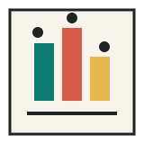
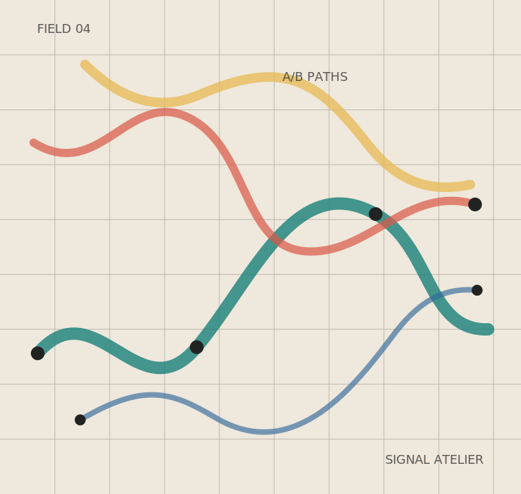

<!-- _class: cover -->
<!-- _header: "" -->
<!-- _footer: "" -->
<!-- _paginate: "" -->



# Signal Atelier

###### 一套偏编辑部气质的 Marp 模板：稳定网格、明快色块、适合讲清楚复杂内容。

2026 TEMPLATE KIT / MARP + CSS

---

<!-- _class: cover cover-side -->
<!-- _header: "" -->
<!-- _footer: "" -->
<!-- _paginate: "" -->

<div>

<p class="kicker">Cover variant</p>

# Field Notes for Product Strategy

###### 侧图封面适合路演、研究汇报或需要突出视觉资产的主题。

2026 / VISUAL BRIEF

</div>

<div class="visual">
  
</div>

---

<!-- _class: cover cover-band -->
<!-- _header: "" -->
<!-- _footer: "" -->
<!-- _paginate: "" -->

# Quarterly Review Kit

###### 色带封面适合更正式的会议材料，标题更集中，也更有开场重量。

BOARD DECK / INTERNAL

---

<!-- _class: toc -->
<!-- _header: "CONTENTS" -->
<!-- _footer: "" -->

## 这套模板展示什么

1. 封面、目录与章节过渡的基础骨架
2. 适合咨询、产品、研究汇报的数据组件
3. 视觉资产、色板和排版层级
4. Markdown 中可直接复用的 HTML 片段
5. 深色重点页、代码页和结束页
6. 可导出 HTML / PDF 的项目结构

---

<!-- _class: toc toc-rail -->
<!-- _header: "CONTENTS VARIANT" -->
<!-- _footer: "" -->

## 纵向目录适合短章节

1. 目标与边界
2. 用户洞察
3. 系统方案
4. 交付节奏
5. 风险控制

---

<!-- _class: divider -->
<!-- _header: "" -->
<!-- _footer: "" -->
<!-- _paginate: "" -->

<div class="chapter">01</div>

<div>

<p class="kicker">Design language</p>

# 用网格建立秩序，用颜色制造记忆点

<p class="lead">模板不是装饰集合，而是一组可反复使用的表达规则。</p>

</div>

---

<!-- _class: divider divider-center -->
<!-- _header: "" -->
<!-- _footer: "" -->
<!-- _paginate: "" -->

<div class="chapter">02</div>

<div>

<p class="kicker">Centered divider</p>

# 居中章节页适合进入一个全新的叙事段落

<p class="lead">标题更像一句断言，而不是普通页面的开头。</p>

</div>

---

## 版式骨架

<div class="columns ratio-60">
<div>

<p class="lead">默认页采用固定边框、80px 网格和低饱和纸张底色，适合承载中文长句、图表解释和产品策略内容。</p>

- 标题区域有明确的水平分隔线
- 正文、注释、代码和指标各有独立字重
- 背景纹理来自 CSS，不依赖远程图片
- 所有组件以 8px 圆角以内的克制形态出现

</div>
<div class="panel dark">

### 核心原则

**不要抢内容的戏。** 视觉元素只负责建立节奏、强调层级和辅助扫读。

<p class="small">适合：项目路演、研究报告、产品复盘、课程讲义、年度计划。</p>

</div>
</div>

---

## 数据卡片

<div class="metric-grid">
  <div class="metric"><b>6</b><span>theme colors</span></div>
  <div class="metric"><b>12</b><span>component classes</span></div>
  <div class="metric"><b>0</b><span>remote assets</span></div>
  <div class="metric"><b>16:9</b><span>native format</span></div>
</div>

<br>

<div class="columns">
<div>

### 适合数字开场

指标卡留出足够空白，读者先看到结论，再进入解释。数字采用 display 字体，标签使用等宽小写风格。

</div>
<div>

### 适合阶段复盘

把一页拆成 3-4 个硬信息块，避免整页堆满项目符号。每个卡片只承载一个判断。

</div>
</div>

---

<!-- _class: dashboard -->

## Dashboard variant

<div class="metric-grid">
  <div class="metric"><b>72%</b><span>adoption signal</span></div>
  <div class="metric"><b>18</b><span>open decisions</span></div>
  <div class="metric"><b>4.6</b><span>quality score</span></div>
  <div class="metric"><b>9</b><span>active tracks</span></div>
  <div class="metric"><b>3</b><span>critical risks</span></div>
</div>

<br>

<p class="small">Dashboard 变体把第一张指标卡放大，适合把一页做成“先结论、再看分项”的数据入口。</p>

---

<!-- _class: compact -->

## 三栏内容组

<div class="tiles">
  <div class="tile">
    <h3>Research</h3>
    <p>用低噪声的页面容纳背景、假设、访谈摘要和证据链。</p>
  </div>
  <div class="tile">
    <h3>Strategy</h3>
    <p>用色条和边框强调阶段、优先级、风险与取舍。</p>
  </div>
  <div class="tile">
    <h3>Delivery</h3>
    <p>用时间线、表格和代码块承接可执行计划。</p>
  </div>
</div>

<br>

<div class="swatches">
  <div>#202322</div>
  <div>#0e7c74</div>
  <div>#d85b4a</div>
  <div>#e7b84e</div>
  <div>#34699a</div>
  <div>#9bc8b8</div>
</div>

<p class="caption">Palette: graphite / teal / coral / amber / blue / mint</p>

---

## 图像与说明


<p class="kicker">Visual asset</p>

<p class="lead">示例图不是装饰背景，而是作为“地图、系统、路径、场域”这类概念的抽象承载。</p>

- SVG 资产放在 `assets/`
- Markdown 可用 Marp 的 `bg right` 指令控制位置
- 左侧留给解释、结论或讲者节奏

---

## 对照页 variant

<div class="comparison">
  <div>
    <h3>Before</h3>
    <ul>
      <li>内容按素材来源堆叠</li>
      <li>每页承担多个观点</li>
      <li>读者需要自己判断优先级</li>
    </ul>
  </div>
  <div>
    <h3>After</h3>
    <ul>
      <li>内容按决策问题组织</li>
      <li>每页只承载一个判断</li>
      <li>视觉层级直接提示阅读顺序</li>
    </ul>
  </div>
</div>

---

<!-- _class: inverse -->

## 深色重点页

<div class="quote-panel">
  <div class="quote-mark">“</div>
  <div>

> 好的模板应该把“如何摆放”这件事从写作者脑中拿走，让注意力回到论证本身。

<p class="small">深色页用于结论、关键转折、章节收束或一句必须被记住的话。</p>

  </div>
</div>

---

## 引用页 variant

<div class="statement">
  <p>把版式压到足够稳定，内容里的微妙差异才会显出来。</p>
</div>

<p class="caption">`.statement` 适合单句结论、方法论摘要、阶段复盘的核心判断。</p>

---

## 时间线

<div class="timeline">
  <div>
    <b>WEEK 01</b>
    <span>梳理材料，确定叙事主线和受众问题。</span>
  </div>
  <div>
    <b>WEEK 02</b>
    <span>完成结构草图，压缩每页只讲一个动作。</span>
  </div>
  <div>
    <b>WEEK 03</b>
    <span>补充证据、图表和关键页的视觉重心。</span>
  </div>
  <div>
    <b>WEEK 04</b>
    <span>排练、删减、导出 PDF / HTML 并检查细节。</span>
  </div>
</div>

---

## 表格与代码

<div class="columns ratio-40">
<div>

| Class | Purpose |
| --- | --- |
| `cover` | 封面 |
| `toc` | 目录 |
| `divider` | 章节页 |
| `inverse` | 深色重点页 |
| `end` | 收尾页 |

</div>
<div>

```markdown
---
marp: true
theme: signal-atelier
paginate: true
---

<!-- _class: divider -->

# Chapter Title
```

</div>
</div>

---

<!-- _class: end -->
<!-- _header: "" -->
<!-- _footer: "" -->
<!-- _paginate: "" -->

<div>

<p class="kicker">Ready to present</p>

# 把复杂内容讲得更清楚

<p class="lead">Signal Atelier / Marp template</p>

</div>
